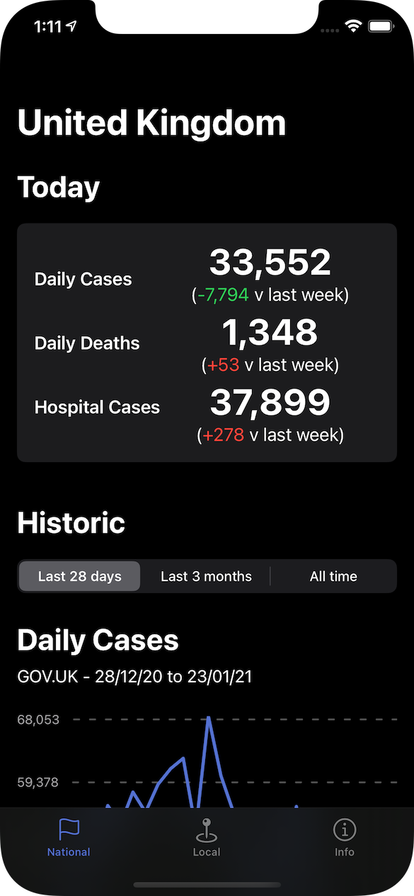
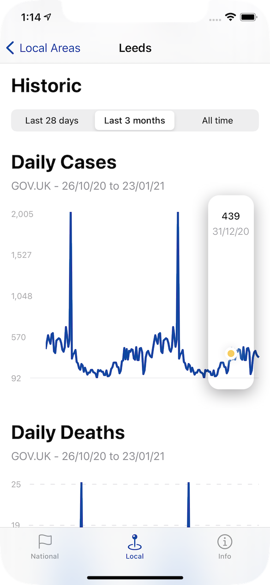

# COVID-19 Stats

COVID-19 Stats is a native iOS app designed to help people stay up-to-date with national and local COVID-19 statistics in the UK using data from GOV.UK.

Apple do not allow COVID-19 related apps on the App Store from independent developers, so I'd like to share it with the developer community just in case it can add any value to those following the pandemic in the UK through these unprecendented times.

To manage expectations, I built this over a few days during the 2020/2021 winter break, so don't be expectating test suites and the cleanest of code. It follows an MVVM architecture with largely testable code, but is by no means perfect.

## Features

- [x] Daily cases, deaths and hospitalisations across the UK
- [x] Daily cases and deaths for specific local authorities in the UK
- [x] Save local authorities for quick reference in the future

## Requirements

- iOS 14.2+
- Xcode 12.2

## Installation

Simply open `COVID-19 Stats.xcodeproj` in Xcode and run (<kbd>⌘R</kbd>) the app! 

This project has a single dependency pulled in using Swift Package Manager that Xcode should retrieve for you. If this fails, with the project open in Xcode, go to `File > Swift Packages > Update to Latest Package Versions`.

## License
[MIT](https://choosealicense.com/licenses/mit/)